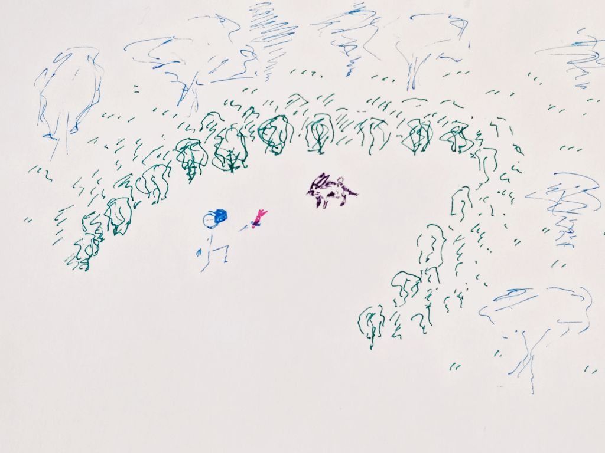
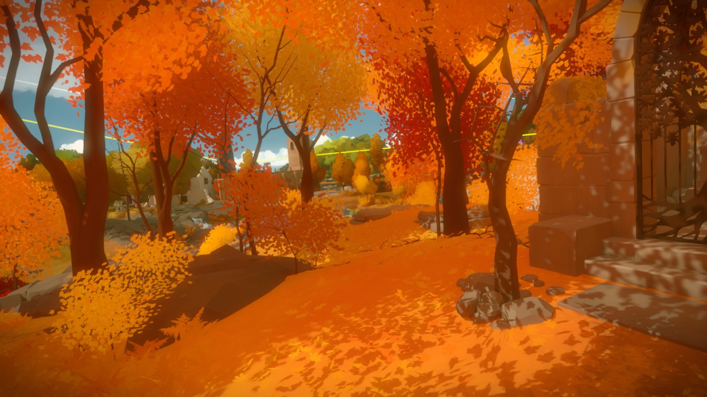

# Peaceful waiting
For this project assignment, we have to create a simulation of a specific experience. My simulation proposal is a meditative waiting while attempting to feed a rabbit on a clear in the woods.

<figure><figcaption>Drawing of the scene</figcaption></figure>

## Category & Questions to answer
**Waiting** - Simulate the experience of waiting. We spend most of our lives doing it (or not doing it). Waiting in line for a plane, movie ticket, subway or download. Waiting for something to happen in our lives (good or bad). We have some notion of what may happen but how and when exactly is unknown. *What feelings does this generate?* What environments are typical of these scenarios? *How does an environment imply something will happen?*

- What are you simulating?
- How does it look, feel and sound?
- How does a user experience and interact with it?
- How do you construct this simulated experience within your technical limits?
- What are the key elements that will make people feel immersed in the simulation?
- What do you want the user to walk away with?

## Proposal
I want to create a meditative waiting simulator. The goal is to give a carrot to a rabbit (or another animal) ultimately to pet it. The animal doesn't come near unless you are offering the food and staying still. Once it is close and eats the food, you can pet it, triggering a haptic response on the controller as a reward.

The goal is to make the waiting an integral part of the experience. Waiting for a train or in a queue makes people feel anxious and they try to remove themselves from that experience as much as possible. In this case, the waiting is still necessary to achieve the goal, but a certain degree of the inaction -staying still- is mandatory to achieve a result. Also, this inaction itself is pleasurable, inducing a meditative(like) state.

The environment would be a small clear in the woods. Bushes, shrubs and long grass and flowers would "block" the user's possibility to teleport out of the zone, but allows them to walk around.

Finally, sound plays an essential role. The animals make noises and give out their position, helping create the immersion of the user. Also, I want to have wind and chimes blowing around, in order to give the meditative ambient vibe.

<figure><figcaption>Inspiration from The Witness</figcaption></figure>

### Challenges
This project has a various technical aspects which I'll need to learn:

- **Reactive foliage**: I need to create foliage that moves with the breeze and becomes agitated when an animal hides there
- **Program animations**: Well, this shouldn't be too hard
- **Program events**: In order to have the rabbits come when you are still AND offering food; have them leave if you move too much; have them stay there and be *"pet-able"*; etc
